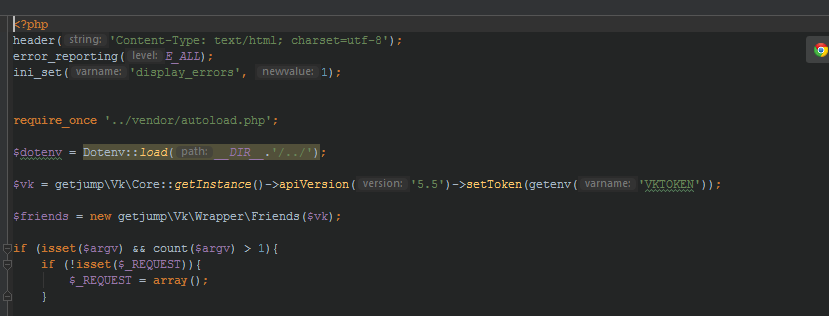

## [Composer](https://getcomposer.org/)

***Системные требования.*** Для работы Composer в последней версии требуется PHP 7.2.5. Версия с долгосрочной поддержкой (2.2.x) по-прежнему поддерживает PHP 5.3.2 и выше, если вы используете устаревшую версию PHP. Также требуются некоторые важные настройки PHP и флаги компиляции, но при использовании установщика вы будете предупреждены о возможных несовместимостях.

Для эффективной работы Composer требуется несколько вспомогательных приложений, которые повышают эффективность обработки зависимостей пакетов. Для распаковки файлов Composer использует такие инструменты, как 7z (или 7zz), gzip, tar, unrar, unzip и xz. Что касается систем контроля версий, Composer легко интегрируется с Fossil, Git, Mercurial, Perforce и Subversion, обеспечивая бесперебойную работу приложения и управление библиотечными репозиториями. Прежде чем использовать Composer, убедитесь, что эти зависимости правильно установлены в вашей системе.

Composer — мультиплатформенный инструмент, и мы стремимся к тому, чтобы он одинаково хорошо работал в Windows, Linux и macOS.

***Установка в Windows.*** -+Скачайте и запустите Composer-Setup.exe. Он установит последнюю версию Composer и настроит переменную PATH, чтобы вы могли вызывать composer из любого каталога в командной строке.

Примечание: закройте текущий терминал. Проверьте работу с новым терминалом: это важно, поскольку переменная PATH загружается только при запуске терминала.

### [Composer:  что нужно знать об управлении зависимостями в PHP](https://skillbox.ru/media/code/composer-vsye-chto-nuzhno-znat-o-sisteme-upravleniya-zavisimostyami-v-php/)

Composer для новичков, здесь можно ознакомиться с командами Composer - а.

### [Composer для самых маленьких](https://habr.com/ru/articles/439200/)

Знакомство с примером VkExtractor (***VkDeepMine***):

Собирайте данные из VK. Это всего лишь идеи о возможном использовании, а не реальный опыт!

- Извлечение данных о друзьях и создание матрицы для выявления общих друзей

- Извлечение путей к изображениям и лайков + тегов

- Загрузка изображений на Flickr для извлечения контекстных тегов на фотографиях

- Определение сферы деятельности человека

- Таргетированная реклама для отдельных лиц с целью сделать специализированное предложение~опрос для получения более подробной информации, предпочтительнее, чем TypeForm

- Запрос на поиск кандидатов в зависимости от сферы деятельности

- Добавить RabbitMQ, чтобы он был включен в список сервисов

***VkDeepMine*** ПРЕДНАЗНАЧЕН ДЛЯ ИСПОЛЬЗОВАНИЯ В ПРЕДЕЛАХ НОРМАЛЬНОГО ПРАВОВОГО РЕГУЛИРОВАНИЯ. Пожалуйста, всегда помните о том, что вы делаете. Я НЕ НЕСУ ОТВЕТСТВЕННОСТИ ЗА УЩЕРБ, ВОЗНИКШИЙ В РЕЗУЛЬТАТЕ ИСПОЛЬЗОВАНИЯ ЭТОГО ПРОГРАММНОГО ОБЕСПЕЧЕНИЯ!

Мои действия 2026-04-08:

#### [1. Загружаю и раскрываю этюд из GitHub](https://github.com/dosjein/vkdeepmine)

#### [2. Устанавливаю пакеты: composer install](#)

```
Microsoft Windows [Version 10.0.26200.8037]
(c) Корпорация Майкрософт (Microsoft Corporation). Все права защищены.

C:\TMapTools\Composer\VkDeepMine2026-04-08\vkdeepmine>composer install
No composer.lock file present. Updating dependencies to latest instead of installing from lock file. See https://getcomposer.org/install for more information.
Loading composer repositories with package information
Updating dependencies
Lock file operations: 10 installs, 0 updates, 0 removals
  - Locking erusev/parsedown (1.8.0)
  - Locking getjump/vk (dev-master 9627cf0)
  - Locking guzzlehttp/guzzle (6.5.x-dev a52f044)
  - Locking guzzlehttp/promises (1.5.x-dev 67ab6e1)
  - Locking guzzlehttp/psr7 (1.9.x-dev e4490ca)
  - Locking psr/http-message (1.1)
  - Locking ralouphie/getallheaders (3.0.3)
  - Locking symfony/polyfill-intl-idn (1.x-dev 9614ac4)
  - Locking symfony/polyfill-intl-normalizer (1.x-dev 3833d72)
  - Locking vlucas/phpdotenv (1.1.x-dev 0cac554)
Writing lock file
Installing dependencies from lock file (including require-dev)
Package operations: 10 installs, 0 updates, 0 removals
  - Downloading erusev/parsedown (1.8.0)
  - Downloading symfony/polyfill-intl-normalizer (1.x-dev 3833d72)
  - Downloading symfony/polyfill-intl-idn (1.x-dev 9614ac4)
  - Downloading psr/http-message (1.1)
  - Downloading guzzlehttp/psr7 (1.9.x-dev e4490ca)
  - Downloading guzzlehttp/promises (1.5.x-dev 67ab6e1)
  - Downloading guzzlehttp/guzzle (6.5.x-dev a52f044)
  - Downloading getjump/vk (dev-master 9627cf0)
  - Downloading vlucas/phpdotenv (1.1.x-dev 0cac554)
  - Installing erusev/parsedown (1.8.0): Extracting archive
  - Installing symfony/polyfill-intl-normalizer (1.x-dev 3833d72): Extracting archive
  - Installing symfony/polyfill-intl-idn (1.x-dev 9614ac4): Extracting archive
  - Installing ralouphie/getallheaders (3.0.3): Extracting archive
  - Installing psr/http-message (1.1): Extracting archive
  - Installing guzzlehttp/psr7 (1.9.x-dev e4490ca): Extracting archive
  - Installing guzzlehttp/promises (1.5.x-dev 67ab6e1): Extracting archive
  - Installing guzzlehttp/guzzle (6.5.x-dev a52f044): Extracting archive
  - Installing getjump/vk (dev-master 9627cf0): Extracting archive
  - Installing vlucas/phpdotenv (1.1.x-dev 0cac554): Extracting archive
4 package suggestions were added by new dependencies, use `composer suggest` to see details.
Generating autoload files
6 packages you are using are looking for funding.
Use the `composer fund` command to find out more!

C:\TMapTools\Composer\VkDeepMine2026-04-08\vkdeepmine>

```
После установки появилась папка vendor, куда сложились установленные пакеты и сформировался файл autoload.php.

#### [3. Создаю проект - index.php](#)

Этот файл подключаем к проекту и всё — библиотеки подключены, можно спокойно с ними работать.



### [Composer: руководство по управлению зависимостями PHP](https://www.dev-notes.ru/articles/php/dependency-management-with-composer/)

#### [Шаг 1: Установите Composer](#)

Если у вас ещё нет Composer, установите его глобально, следуя официальному руководству. После установки проверьте работу, выполнив в терминале:

```
composer --version
```

Вы должны увидеть номер версии (например, Composer version 2.9.5 2026-01-29 11:40:53).

```
C:\TMapTools\Composer>composer --version
Composer version 2.9.5 2026-01-29 11:40:53
PHP version 7.3.31 (c:\PHP\php.exe)
Run the "diagnose" command to get more detailed diagnostics output.

C:\TMapTools\Composer>
```
#### [Шаг 2: Создайте composer.json](#)

Вместо интерактивного опроса (***composer init***) давайте сразу создадим минимальную рабочую конфигурацию. Перейдите в папку вашего нового проекта и выполните одну команду:

```
composer init --name=myproject/app --no-interaction
```

Эта команда мгновенно создаст файл composer.json с указанным именем и стандартными настройками. Теперь проект готов к добавлению пакетов.

#### [Шаг 3: Добавьте первый пакет](#)

Допустим, нам нужна библиотека для логирования. Вместо ручного скачивания просто выполните:

```
composer require monolog/monolog
```

Что сделает Composer:

Найдёт последнюю стабильную версию пакета monolog/monolog на Packagist.org.
Скачает её и все её зависимости в папку vendor/.

Автоматически добавит запись о пакете и используемой версии в composer.json.
Создаст/обновит файл composer.lock, который фиксирует точные версии всех установленных библиотек.

```
C:\TMapTools\Composer\myproject>composer require monolog/monolog
Cannot use monolog/monolog's latest version 3.10.0 as it requires php >=8.1 which is not satisfied by your platform.
./composer.json has been updated
Running composer update monolog/monolog
Loading composer repositories with package information
Updating dependencies
Lock file operations: 2 installs, 0 updates, 0 removals
  - Locking monolog/monolog (2.11.0)
  - Locking psr/log (1.1.4)
Writing lock file
Installing dependencies from lock file (including require-dev)
Package operations: 2 installs, 0 updates, 0 removals
  - Downloading psr/log (1.1.4)
  - Downloading monolog/monolog (2.11.0)
  - Installing psr/log (1.1.4): Extracting archive
  - Installing monolog/monolog (2.11.0): Extracting archive
10 package suggestions were added by new dependencies, use `composer suggest` to see details.
Generating autoload files
1 package you are using is looking for funding.
Use the `composer fund` command to find out more!
No security vulnerability advisories found.
Using version ^2.11 for monolog/monolog

C:\TMapTools\Composer\myproject>
```

#### [Шаг 4: Проверьте установку](#)

Создайте в папке проекта простой тестовый файл test.php:

```
<?php
// Подключаем автоматически сгенерированный загрузчик
require __DIR__ . '/vendor/autoload.php';

use Monolog\Logger;
use Monolog\Handler\StreamHandler;

// Создаём логгер
$log = new Logger('my_app');
$log->pushHandler(new StreamHandler('logs/app.log', Logger::DEBUG));

// Используем его!
$log->info('Зависимость Monolog успешно установлена и работает!');
echo "Проверьте файл logs/app.log - там должно быть сообщение.\n";
```

Запустите скрипт:

```
php test.php
```

Если вы видите сообщение и в папке logs/ появился файл app.log с записью — поздравляем! 

Вы только что установили и использовали свою первую зависимость через Composer.

Итог за 5 минут: У вас есть проект с управляемыми зависимостями, рабочим автозагрузчиком и ключевыми файлами (composer.json, composer.lock).


